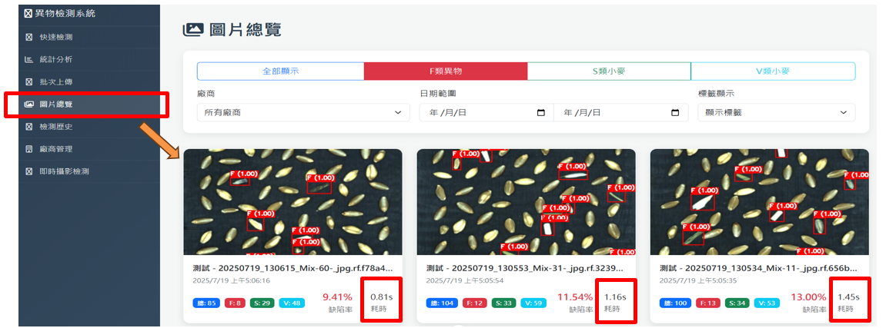

# 🧠 TwoStage-DefectSystem

本專案為結合 **YOLOv5s** 與 **EfficientNetV2-S** 的雙階段缺陷檢測系統，可應用於瑕疵檢測、自動分類等場景。

---

<h3>📌 系統流程圖</h3>

  

---

<h3>📌 實作流程</h3>

  

---

<h3>📌 實作流程</h3>

  

---

<h3>📌 實作流程</h3>

  

---

<h3>📌 效能</h3>

  

---

## 🎯 雙階段系統簡介

- 🔹 **第一階段 - YOLOv5s**
  - 對整張圖片進行快速物件偵測，找出缺陷候選區域
- 🔹 **第二階段 - EfficientNetV2s**
  - 對候選區域進行圖像分類，辨識缺陷類型

---

## 🔄 系統完整流程

1. 將原始 TIF 格式資料轉換為 JPG
2. 圖片標註（YOLO 格式）
3. 訓練 YOLOv5s 模型
4. 根據 YOLO 標註，自動裁切分類模型資料集
5. 訓練 EfficientNetV2s 模型
6. 測試雙模型結合推論
7. 前後端與資料庫部屬整合

---

## 🧪 模型訓練流程（使用 Google Colab）

1. 訓練 YOLOv5s
2. 訓練 EfficientNetV2s
3. 執行雙階段結合推論程式

📂 [點我進入雲端資料夾](https://drive.google.com/drive/folders/1Id0aTjWZQ73lc_3HOMBqD-YMszYA39OG?usp=drive_link)  
內含訓練與推論的 `.ipynb` 筆記本檔案：

| Notebook 說明            | 路徑                                  |
| ------------------------ | ------------------------------------- |
| YOLOv5s 訓練流程         | `/程式/yolov5s.ipynb`                 |
| EfficientNetV2s 訓練流程 | `/程式/EfficientNetV2s.ipynb`         |
| 雙階段模型推論           | `/程式/yolov5s+EfficientNetV2s.ipynb` |

---

## 🔗 模型與結果下載連結（Google Drive）

請從雲端資料夾中下載以下模型與結果：

| 模型或資料           | 路徑                          |
| -------------------- | ----------------------------- |
| YOLOv5s 權重         | `/輸出/yolo 輸出/`            |
| EfficientNetV2s 權重 | `/輸出/EfficientNetV2s 輸出/` |
| 雙階段模型推論結果   | `/輸出/yolo+efficientnet/`    |

---

## 🖼️ 成果展示

本系統亦整合了圖形化介面與後端 API，支援缺陷追溯、即時檢測與歷史統計等功能，以下為部分功能展示畫面：

### 實驗效能

  

### 快速檢測

  

### ✅ 圖片追溯

  

### ✅ 統計與歷史

  

### ✅ 結合攝像頭拍照檢測

  

---

## 📁 資料集格式說明

> 資料集皆存於 Google Drive，內含：

- 原始圖片
- YOLOv5 標註格式（`.txt`）
- Crop 後供 EfficientNet 分類使用的子圖

---

## ✉️ 聯絡方式

如需了解更多細節，歡迎聯絡我：

- **作者**：[李柏駿]
- **Email**：<yahoo0976095579@gmail.com>
